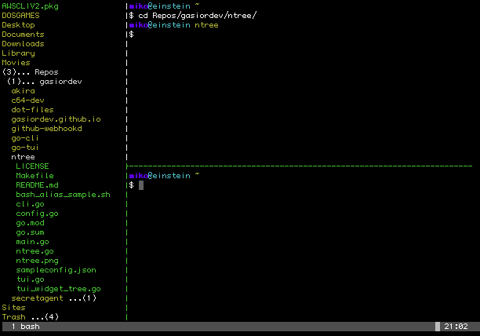

# ntree

ntree is a tiny program that displays directories and files of a given path and
expands the subdirectories that are your current working directory.

Check the screenshot for the following command:

```ntree start -r /Users/miko -w /Users/miko/Repos/gasiordev/ntree
```




